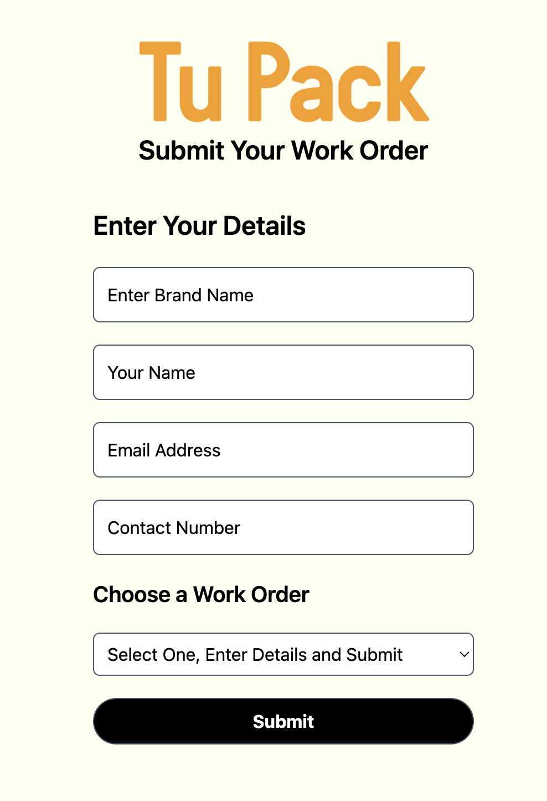

Work Orders Form
=================

Next.js form to submit new Work Orders for the Work Management System.



### Getting started
```
# request and update .env.local file
git clone git@github.com:eds-101/work-orders-form.git
cd work-orders
yarn  # install dependencies
yarn dev # start server, get localhost link
```

PengDevs 
